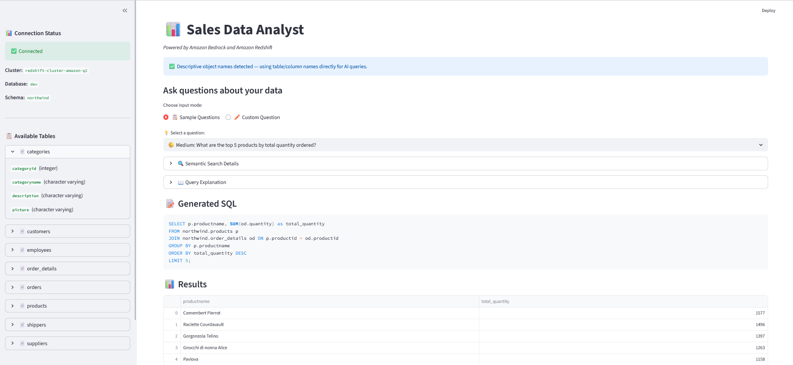
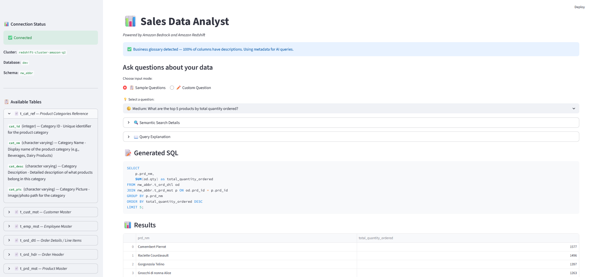

# Amazon Bedrock & Amazon Redshift Sales Analyst POC (Text to SQL)
**Authors: Senthil Kamala Rathinam, Shashi Makkapati, Jacob Scheatzle**

## Overview of Solution

This is sample code demonstrating the use of Amazon Bedrock and Generative AI to create an intelligent sales data analyst that uses natural language questions to query relational data stores, specifically Amazon Redshift. This example leverages the complete Northwind sample database with realistic sales scenarios containing customers, orders, and order details.

The application supports both **descriptive schemas** (readable table/column names) and **cryptic/abbreviated schemas** with business glossary metadata via Redshift's `COMMENT ON` feature. It automatically detects which type of schema you're working with and adapts accordingly.

**Please Note: If you don't want to build this from scratch, Amazon Redshift now supports GenAI capabilities natively, more information on that can be found [here](https://aws.amazon.com/blogs/aws/amazon-redshift-adds-new-ai-capabilities-to-boost-efficiency-and-productivity/).**






## Goal of this POC
The goal of this repo is to provide users the ability to use Amazon Bedrock and generative AI to ask natural language questions about sales performance, customer behavior, and business metrics. These questions are automatically transformed into optimized SQL queries against a private Amazon Redshift cluster. This repo includes complete infrastructure automation, security hardening, and intelligent context retrieval.

The architecture & flow of the POC is as follows:


When a user interacts with the POC, the flow is as follows:

1. **Natural Language Query**: The user makes a request through the Streamlit interface, choosing from sample queries (Simple/Medium/Complex) or entering a custom question (`app.py`)

2. **Context Retrieval**: The system performs semantic search using FAISS vector store to retrieve only the relevant tables and columns. Tables are filtered by embedding distance, and columns within large tables are further filtered by semantic similarity to the question (`src/graph/workflow.py` - `retrieve_context()`)

3. **Intelligent SQL Generation**: Amazon Bedrock (Claude Sonnet 4.5) generates optimized SQL queries using the filtered context, ensuring proper table joins and data type handling. Generated SQL is validated to be read-only (SELECT only) before execution (`src/graph/workflow.py` - `generate_sql()`)

4. **Secure Query Execution**: The SQL query is executed against the Redshift cluster through a connection pool. For private clusters, connection goes through a secure SSM tunnel via the EC2 bastion host (`src/utils/redshift_connector_iam.py`)

5. **Result Analysis**: The retrieved data is passed back to Amazon Bedrock for intelligent analysis and insight generation (`src/graph/workflow.py` - `analyze_results()`)

6. **Natural Language Response**: The system returns comprehensive insights, a plain-English query explanation, and semantic search details to the user through the Streamlit frontend (`app.py`)

# How to use this Repo:

## Prerequisites:

1. [AWS CLI](https://docs.aws.amazon.com/cli/latest/userguide/getting-started-install.html) installed and configured with access to Amazon Bedrock, EC2, Redshift, and IAM.

2. [Python](https://www.python.org/downloads/) v3.11 or greater. The POC runs on Python.

3. **AWS Authentication**: This project uses flexible AWS authentication that works in multiple environments:
   - **EC2 Instance**: Automatically uses IAM role attached to the instance (no credentials needed)
   - **Local Machine**: Uses AWS CLI credentials from `~/.aws/credentials` (run `aws configure`)
   - **Required AWS Permissions**: 
     - Bedrock: `bedrock:InvokeModel`, `bedrock-runtime:InvokeModel`
     - Redshift: `redshift:*` (for cluster management)
     - EC2: `ec2:*` (for bastion host)
     - SSM: `ssm:*` (for secure tunneling)
     - IAM: `iam:*` (for role creation)

4. AWS account with permissions to create Redshift clusters, EC2 instances, VPCs, and IAM roles.

5. **Note**: This project uses robust security with private infrastructure and no public endpoints. Ensure you're running the application on your native operating system (Windows/macOS/Linux) rather than WSL2, as the SSM tunnel functionality works more reliably on native systems.

## Steps

1. Install Git (Optional step):
    ```bash  
    # Amazon Linux / CentOS / RHEL:
    sudo yum install -y git
    # Ubuntu / Debian:
    sudo apt-get install -y git
    # Mac/Windows: Git is usually pre-installed
    ```

2. Clone the repository to your local machine.

    ```bash
    git clone https://github.com/aws-samples/genai-quickstart-pocs.git
    
    ```
    
    The file structure of this POC is organized as follows:
    
    * `requirements.txt` - All dependencies needed for the application
    * `app.py` - Main Streamlit application with UI, setup wizard, and query interface
    * `src/bedrock/bedrock_helper_iam.py` - Amazon Bedrock client wrapper (Claude Sonnet 4.5 + Titan Embed v2)
    * `src/graph/workflow.py` - AI workflow: semantic search → SQL generation → execution → analysis
    * `src/vector_store/faiss_manager.py` - FAISS vector store for per-table semantic search
    * `src/utils/redshift_cluster_manager.py` - Automatic AWS infrastructure provisioning
    * `src/utils/redshift_connector_iam.py` - Connection pooling and secure database access
    * `src/utils/northwind_bootstrapper.py` - Automatic sample data loading
    * `src/config/settings.py` - Application configuration (model ID, region)
    * `cleanup.py` - AWS resource cleanup script

3. Open the repository in your favorite code editor. In the terminal, navigate to the POC's folder:
    ```bash
    cd genai-quickstart-pocs/genai-quickstart-pocs-python/amazon-bedrock-amazon-redshift-text-to-sql-poc
    ```

4. Configure the Python virtual environment, activate it:
    ```bash
    python3 -m venv .venv
    source .venv/bin/activate  # On Windows: .venv\Scripts\activate
    ```

5. Install project dependencies. This automatically detects your platform and installs the right dependencies:

    Amazon Linux 2023: Installs SQLite libraries + FAISS fixes

    Ubuntu: Installs build tools + dependencies
    
    Mac/Windows: Uses standard pip install

    ```bash
    python3 setup.py
    ```

6. **Configure AWS Credentials** (Environment-specific):

   **Option A: Running on AWS EC2 Instance**
   
   Attach an IAM role to your EC2 instance with the required permissions listed above.
   
   No additional credential configuration needed - the application automatically uses the instance's IAM role.
   
   **Option B: Running on Local Machine (Windows/Mac/Linux)**
   
   Configure AWS CLI with your credentials:
   ```bash
   aws configure
   ```
   
   Enter your AWS credentials when prompted:
   ```
   AWS Access Key ID: YOUR_ACCESS_KEY
   AWS Secret Access Key: YOUR_SECRET_KEY
   Default region name: us-east-1
   Default output format: json
   ```
   
   This creates `~/.aws/credentials` file that the application automatically uses.
   
   Verify your credentials:
   ```bash
   aws sts get-caller-identity
   ```

7. Create a `.env` file in the root folder. Copy from `.env.example` and update as needed:

    ```bash
    cp .env.example .env
    ```

    The `.env` file should contain:

    ```bash
    # AWS Configuration
    AWS_REGION=us-east-1

    # Option 1 Default Cluster Configuration (Required for Option 1)
    OPTION1_CLUSTER_ID=sales-analyst-cluster
    OPTION1_DATABASE=sales_analyst
    OPTION1_SCHEMA=northwind
    OPTION1_USER=admin
    OPTION1_PASSWORD=YourSecurePassword123!

    # Option 3 Default Connection (pre-populates the UI form)
    OPTION3_HOST=your-cluster.xxx.redshift.amazonaws.com
    OPTION3_DATABASE=dev
    OPTION3_SCHEMA=your_schema
    OPTION3_USER=awsuser
    OPTION3_PASSWORD=YourPassword123!

    # SSL Configuration (Required for Redshift)
    REDSHIFT_SSL_MODE=require
    ```

    ⚠️ **Important**: 
    - Change `OPTION1_PASSWORD` to a secure password (required for Option 1)
    - Password must meet AWS Redshift requirements: 8-64 characters, at least one uppercase, one lowercase, and one number
    - `OPTION3_*` variables are optional — they pre-populate the Option 3 connection form for convenience
    - Never commit `.env` file to version control

8. **EC2-Specific Configuration** (Skip if running locally):
   
   If running on an Amazon EC2 instance, configure the Security Group to access the Streamlit UI from your browser: 

    - Go to EC2 Console → Security Groups
    - Edit your EC2's security group
    - Add inbound rule: Port 8501, Source: Your IP (or 0.0.0.0/0 for public access)

9. Start the application from your terminal:
    ```bash
    streamlit run app.py
    ```

10. **Setup Options**: The application provides three setup options:

   **Option 1: Create New Cluster**
   - Creates a new private Redshift cluster with default settings from `.env`
   - Automatically loads Northwind sample data
   - Sets up secure SSM tunnel for connection
   - Takes ~10 minutes for complete setup

   **Option 2: Load to Existing Cluster**
   - Connect to your existing Redshift cluster
   - Loads Northwind sample data into your cluster
   - Indexes the schema for AI queries
   - Takes ~5 minutes

   **Option 3: Use Existing Data**
   - Connect to your existing Redshift cluster with your own data
   - Connection form is pre-populated from `OPTION3_*` variables in `.env`
   - No data loading - uses your existing tables
   - Indexes your schema for AI queries
   - Takes ~2 minutes

11. **Start Analyzing**: Once setup is complete, you can use sample queries (Simple/Medium/Complex) from the dropdown or enter custom questions:
   - "What are the top 5 customers by order value?"
   - "Show me monthly sales trends for 1997"
   - "Which products have the highest profit margins?"
   - "What countries generate the most revenue?"

12. **Try the Cryptic Schema Demo** (Optional — recommended for learning):

   After setting up Northwind (Option 1 or 2), you can create an abbreviated version of the same database to see how the application handles cryptic/non-obvious table and column names.

   **How to create it:**
   - Connect to the `northwind` schema via any setup option
   - In the sidebar, find the **🧪 Demo: Cryptic Schema** section
   - Click **🧪 Create nw_abbr Schema** (~30 seconds)
   - This creates a `nw_abbr` schema with tables like `t_cust_mst`, `t_ord_hdr`, `t_prd_mst` — all with abbreviated column names
   - It also adds `COMMENT ON` metadata (business glossary descriptions + `[FK:]` relationship hints) to every table and column

   **How to use it:**
   - Click **⬅️ Back to Setup** in the sidebar
   - Choose **Option 3** (Use Existing Data)
   - Enter your connection details with schema = `nw_abbr`
   - Try the same sample questions — they return identical results despite the cryptic names

   **What you'll see in the sidebar:**

   | Connected to | Sidebar shows |
   |---|---|
   | `northwind` + `nw_abbr` doesn't exist | 🧪 **Create nw_abbr Schema** button |
   | `northwind` + `nw_abbr` already exists | ✅ Confirmation message (no button) |
   | `nw_abbr` or any other schema | Section hidden (not relevant) |

   **What this demonstrates:**
   - **Business Glossary**: Cryptic names like `cmpny_nm` are matched to "Company Name" via `COMMENT ON` metadata
   - **Relationship Manager**: The `[FK:]` hints in column comments and `relationships.yaml` entries provide explicit JOIN paths — without these, the AI would have no way to know that `t_ord_hdr.cust_id` joins to `t_cust_mst.cust_id`
   - **🔗 Manage Relationships** panel in the sidebar shows all detected relationships with origin badges (📝 from comments, 🔧 from YAML)

   This is the best way to understand how the Relationship Manager works before applying it to your own schemas. See [RELATIONSHIP_MANAGER.md](RELATIONSHIP_MANAGER.md) for full documentation.


## Cleanup

To avoid ongoing AWS charges, run the cleanup script when finished:

```bash
python3 cleanup.py
```

This will automatically remove all created AWS resources including the Redshift cluster, EC2 instance, and associated infrastructure.

## Architecture Highlights

- **Per-Table Semantic Search**: Each table is indexed as a separate FAISS document with column-level filtering — only relevant tables and columns are passed to the LLM
- **Business Glossary Support**: Automatically reads `COMMENT ON` metadata from Redshift tables/columns and uses business descriptions for semantic matching on cryptic schemas
- **Glossary Auto-Detection**: Detects whether your schema uses descriptive names or cryptic/abbreviated names and shows appropriate guidance
- **Relationship Manager**: Merges join metadata from 4 sources (FK constraints, `COMMENT ON` `[FK:]` patterns, YAML config, UI edits) so the AI generates correct JOINs even without database-level constraints — [full docs](RELATIONSHIP_MANAGER.md)
- **SQL Safety Validation**: Generated SQL is validated to be read-only (SELECT only) before execution — blocks DROP, DELETE, UPDATE, INSERT, etc.
- **Connection Pooling**: Reuses database connections via `psycopg2` connection pool with stale connection recovery
- **Enterprise Security**: Private networking with secure SSM tunnels, parameterized SQL queries
- **Flexible Authentication**: Works seamlessly on EC2 (IAM role) or local machines (AWS CLI credentials)
- **Cached Schema Indexing**: Schema metadata and embeddings are cached across Streamlit reruns to avoid redundant Bedrock API calls

## Bastion Host & SSM Tunnel

The Redshift cluster is created in a **private subnet with no public access**. To connect, the application automatically creates an EC2 bastion host (`t3.micro`) and establishes an SSM port-forwarding tunnel:

```
Your Machine (localhost:5439) → SSM Tunnel → EC2 Bastion → Private Redshift Cluster
```

**What you need to know:**
- **Option 1 (Create New Cluster)** automatically provisions the bastion host during setup
- **Options 2 & 3** create a bastion if your existing cluster is private (not publicly accessible)
- The bastion requires the **AWS Session Manager plugin** installed on your local machine. The setup script installs it automatically, but if it fails, install manually from [here](https://docs.aws.amazon.com/systems-manager/latest/userguide/session-manager-working-with-install-plugin.html)
- The bastion is a `t3.micro` EC2 instance — it incurs standard EC2 charges while running
- If the bastion instance is **stopped** (e.g., manually or by AWS), the application will not be able to connect to Redshift. Restart it from the EC2 console or run: `aws ec2 start-instances --instance-ids <bastion-instance-id>`
- Run `python3 cleanup.py` when finished to remove the bastion and all other created resources

## Business Glossary Support (COMMENT ON)

For schemas with cryptic/abbreviated object names (e.g., `t_cust_mst`, `cmpny_nm`), the application leverages Redshift's `COMMENT ON` feature as a business glossary:

```sql
-- Add business descriptions to tables
COMMENT ON TABLE nw_abbr.t_cust_mst IS 'Customer Master - Contains all customer records';

-- Add business descriptions to columns
COMMENT ON COLUMN nw_abbr.t_cust_mst.cmpny_nm IS 'Company Name - Official registered name';
```

The application automatically:
1. **Detects** whether your schema has descriptive or cryptic names
2. **Reads** `COMMENT ON` metadata from `pg_description` during schema indexing
3. **Enriches** FAISS documents with business descriptions for accurate semantic matching
4. **Shows** a banner indicating glossary status (✅ glossary detected, ⚠️ cryptic names without glossary)

This enables the semantic search to correctly match "customers" → `t_cust_mst` via the "Customer Master" comment.

## Relationship Manager (Table JOINs without FK Constraints)

Most Redshift data warehouses don't define primary key or foreign key constraints — Redshift treats them as informational only, so teams often skip them. Without these constraints, the AI has no metadata describing how tables relate to each other and must guess JOIN conditions from column names alone. This works for descriptive schemas but fails for cryptic/abbreviated ones.

The **Relationship Manager** solves this by collecting join metadata from 4 sources (FK constraints, `COMMENT ON` patterns, YAML config, and UI edits), merging them with deduplication, and injecting explicit `Relationships:` into each table's vector store document.

**Quick example** — add `[FK:]` hints to column comments:
```sql
COMMENT ON COLUMN nw_abbr.t_ord_hdr.cust_id IS 'Customer ID - References the customer [FK: t_cust_mst.cust_id]';
```

Or define relationships in `relationships.yaml`:
```yaml
nw_abbr:
  - source: t_ord_hdr.cust_id
    target: t_cust_mst.cust_id
    description: "Order placed by customer"
```

Or use the **🔗 Manage Relationships** panel in the Streamlit sidebar to add/edit/delete relationships visually.

📖 **[Full documentation → RELATIONSHIP_MANAGER.md](RELATIONSHIP_MANAGER.md)** — includes detailed scenarios, behind-the-scenes walkthrough, before/after examples, and a quick start checklist.


### Built with:

- Amazon Bedrock (Claude Sonnet 4.5): LLM for SQL generation and analysis
- Amazon Bedrock (Titan Embed v2): Embedding model for semantic search
- Amazon Redshift: Private data warehouse for fast analytics
- EC2 + SSM: Bastion host with Session Manager tunnel
- FAISS: Vector database for per-table semantic search
- Streamlit: Web interface
- psycopg2: Connection pooling for Redshift

### Security Architecture:
- Your Computer → SSM Tunnel → EC2 Bastion → Private Redshift Cluster
(localhost:5439)    (AWS Session Manager)    (No public access)


## Troubleshooting
### Common Issues
- **"Permission denied" errors**:
    - Verify your EC2 instance has proper IAM role attached
    - Check IAM role has permissions for Bedrock, Redshift, EC2, and SSM

- **"Setup fails" or timeouts**:
    - Run python3 cleanup.py first
    - Try a different AWS region in .env (us-west-2, eu-west-1)
    - Ensure you have sufficient AWS service limits
    - Wait for bastion host SSM agent to come online (can take 2-3 minutes)

- **"Credentials not found" or "Unable to locate credentials"**:
    - **On EC2**: Verify IAM role is attached to instance: `aws sts get-caller-identity`
    - **On Local Machine**: Run `aws configure` to set up credentials
    - Verify credentials work: `aws bedrock list-foundation-models --region us-east-1`
    - Ensure `.env` file has `AWS_REGION` set correctly

- **"OPTION1_PASSWORD must be set" error (Option 1 only)**:
    - Open `.env` file and set `OPTION1_PASSWORD=YourSecurePassword123!`
    - Password must be 8-64 characters with uppercase, lowercase, and number
    - Restart the application after updating `.env`

- **"Connection pool exhausted"**:
    - This can happen if many queries are run rapidly or after connection errors
    - Restart the Streamlit application to reset the connection pool

- **"App won't start"**:
    - Ensure Python 3.11+ is installed: python3 --version
    - Install requirements: pip install -r requirements.txt
    - Try: python3 -m streamlit run app.py

- **"Connection failed" or "SSM tunnel failed"**:
    - The app uses a private Redshift cluster with bastion host for security
    - Connection goes through localhost:5439 via SSM tunnel
    - If connection fails, wait 2-3 minutes for SSM agent to initialize

- **"Session Manager plugin issues"**:
    - The setup script automatically installs the Session Manager plugin
    - If installation fails, the app will show manual installation instructions
    - Plugin is required for secure SSM tunneling to private Redshift cluster

### Getting Help
- Check AWS CloudFormation console for detailed error messages
- Review AWS costs in Billing console
- Ensure your AWS account has no service limits blocking resource creation


## ⚠️ Important: Proof of Concept

**This is a Proof of Concept (POC) for demonstration purposes.**

This application demonstrates the art of possibility with Amazon Bedrock and Redshift. While it includes security best practices like IAM authentication and private networking, it is designed for learning and experimentation.

**Before using in production environments:**
- Replace `.env` passwords with AWS Secrets Manager
- Add input validation and rate limiting for user queries
- Enable SSL certificate validation (`verify-full`) for Redshift connections
- Review and apply principle of least privilege to IAM permissions
- Implement comprehensive logging and monitoring
- Add authentication and authorization for the Streamlit interface
- Conduct a full security audit and penetration testing
- Review AWS Well-Architected Framework guidelines

**Current Security Features (POC-appropriate):**
- ✅ IAM role-based authentication (no hardcoded AWS keys)
- ✅ Private Redshift cluster with no public access
- ✅ Secure SSM tunneling through bastion host
- ✅ Parameterized SQL queries to prevent injection
- ✅ SQL read-only validation (blocks DROP, DELETE, UPDATE, INSERT)
- ✅ Environment variables for configuration
- ✅ `.env` file excluded from version control
- ✅ Connection pooling with stale connection recovery
